# Ethereum DApp using Truffle, Ganache and Metamask

## Objectives:
- To create ethereum  decentralised web application using truffle, ganache and metamask
## Submission: 
- Five checkpoints.

## Description:
In this tutorial, you will learn how to deploy smart contract using the very well-known smart-contract development environment called Truffle (https://trufflesuite.com/)  and Ganache, an in-memory blockchain that simulates Ethereum blockchain functionalities without requiring to setup Ethereum private network. You will also utilise Metamask (https://metamask.io/) to offload several tasks of account management. A combination of these actually abstracts away a lot of internal complexities so that programmers do not need to worry about setting up the development environment.

In this lab, you will learn
- how to install and setup Ganache & Metamask 
- how to utilise Ganache and Truffle together with Metamask, 
- how to write and test a smart contract using Truffle and Solidity, and
- how to develop and deploy a DApp to interact with this.

# Section-1: Development environment setup
The first step is to set up Truffle and Ganache.

1. To set up truffle, it  is recommended to use  Node Version Manager (nvm) according to its [documentation](https://trufflesuite.com/docs/truffle/how-to/install/). Therefore, even if you already have node installed, I recommend you to  install nvm  and then set up truffle using  it, otherwise you may get an error doing it.  To install nvm issue the  command on your  terminal:

```shell
curl -o- https://raw.githubusercontent.com/nvm-sh/nvm/v0.39.2/install.sh | bash
```

if you do not have curl installed, then issue command : ```sudo apt install curl``` and then use the above command again. 

To install truffle without nvm( not recommended ) follow this [link](https://trufflesuite.com/docs/truffle/how-to/install/#install-truffle)

2. Once the nvm is installed  use the command : ```nvm install 18.15.0```  this will install the node version: 18.15.0 which is the current LTS node version. After that  you should restart your terminal (close and reopen) and then run the command: ```node -v```  and this will return the version of node we just installed.  

3. Now to make the node version 18.15.0 as your default node version run: ```nvm alias default 18.15.0```. Now close and reopen the   terminal from the previous directory. Now, check the node version again using: ```node -v```. You should see something like: *v18.15.0*

4. Now install truffle using command: ```npm install -g truffle```  and after installation check its version using: ```truffle version```  and this will return some of the package and library with  the version that truffle comes with like below:

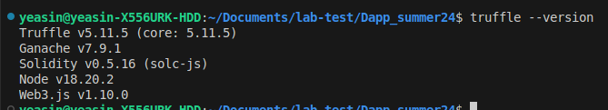

5. Next, we will install Ganache by downloading it from this location: https://trufflesuite.com/ganache/ . But before installing ganache we need some additional tools to install it. To install the additional tools run the command below: 

```shell
sudo add-apt-repository universe && sudo apt install libfuse2
```

6. Next,  go to the Download directory of and locate the recently downloaded file of ganache. Right click on the Ganache file and click the Properties option. From there, choose the Permissions tab. Tick the “**Allow executing file as a program**” option (the following figure-1). Now the file is ready to be executed by a double click. 

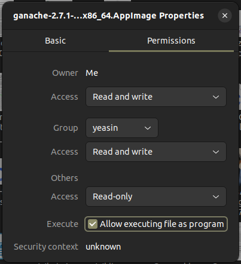

7. After a double click ganache will be loaded, click the quick run option and you will see a dashboard of a private network with some pre funded accounts. However, at first you need to pay attention to change the port. To do that, go to setting > server and change the port to 8545, save & restart it. Next, you will see the following ganache GUI and on the top of the ganache dashboard you should see the "RPC Server" of ganache as "http://127.0.0.1:8545". 

Note: While starting you can create a new workspace, so that in future you can start from where you left.


8. If Metamask is already available on your browser, you can skip this Step.Else, you need to install Metamask. Go to the https://metamask.io/ and install the extension for your preferred browser. 


9. The Metamask initial window will look like the following figure-3. Follow the on-screen instructions to set up Metamask. While setting up, backup the mnemonics phrase for your Metamask account. We already used it in our last lab, therefore it should be installed on the browsers.

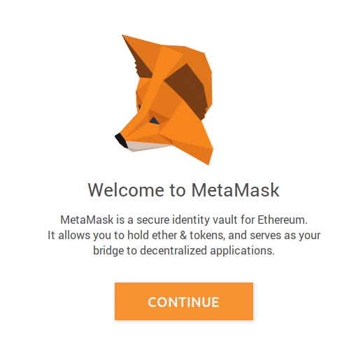

10. Next, from the list of available network options choose a private network on Metamask by selecting the `localhost:8545` or `127.0.0.1:8545` option(You may not have this option initially. Don't worry continue reading). This will allow Metamask to connect to the local ganache network instead of the Main-net or Test-net. 
<!-- If the localhost option is not available, click “open/show network”, which will popup a window. Enable show test network from there.  Metamask may try to connect initially and after loading a while you may get a connection failure message. Don’t worry, we didn’t connect it yet. If you get such a message just close the pop-up message. Now, If you have localhost:8545 testnet available in your network list skip the steps below and start from step 11. -->

#### No `localhost:8545` or `127.0.0.1:8545` option in the metamask network list ? Follow the instruction below: 
If you do not have `localhost:8545` or `127.0.0.1:8545` network option in your metamask network list, you have to manually add this. To do this:
- In the upper left corner of metamask, click the network you're currently connected to. This will show the currently available mainnet and testnet. Select "Add network".

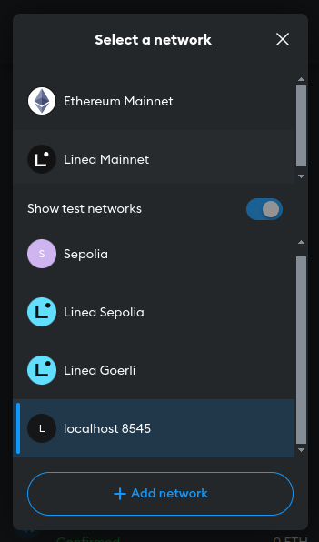

- Once you click it, a new browser tab will open and you will find an option "Add Network Manually" at the bottom. Click that option. you will see a window like below:

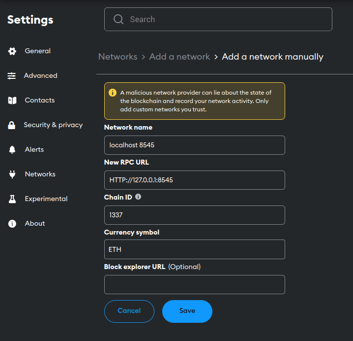

Enter the values mentioned in the picture above. Make sure your ganache "RPC Server" and "New RPC Server" is same.

- Enter your network name as below:
```localhost:8545```

- RPC URL is basically the RPC server url of ganache. (If your are curious about RPC protocol you may explore it after the lab.)

- Network chain ID `1337` is the default chain ID. (FYI, here hexadecimal format is also supported). 

- Currency symbol "ETH" this is basically the dummy currency identifier. 

11. Now, go to the Ganache window, click the key icon of the third or fourth account and copy the private key.

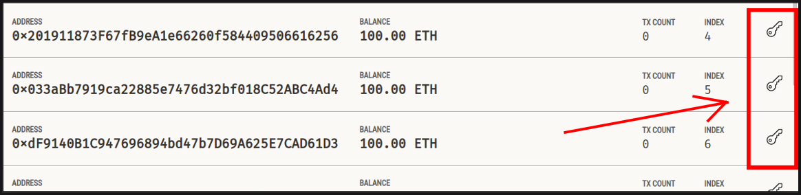

12. In the Metamask window, Import the account using the private key. We already know how to import account using private key from our very first lab.

13. After clicking Import Account option, once prompted, paste the private key  and click the Import button. This will add the selected account from ganache on Metamask. You can also see the same account address with a  dummy balance of 100 currency in both ganache and metamask.

14. Now, check if you already have git installed or not by the command: ```git version```, this will return a version. But if you do not have git installed, then install it using command: ```sudo apt install git```.

15. Now, we will download/clone a blockchain visualiser from [here](https://github.com/etherparty/explorer). After downloading/cloning the  zip file, Unzip(if it is in .zip format) the file and you will see a file named “**explorer-master**” or “**explorer**”. Move the file to a folder where you will work for today’s lab.  Now, go to “**explore-master/explorer**” or inside "**explorer**" folder and open a terminal from there to run the following command: ```npm start```. This will create a local server on http://localhost:8000 where you can see all the transaction reports similar to https://etherscan.io (Sample image below). However, Initially there will be no data. You should remember this visualiser is just to give you a small idea  about transaction reports. There are many features in this that are not well functioned. Therefore, don’t get confused  with the value you don’t understand.  Getting the idea of transactions and blocks are  good enough for the lab purpose.

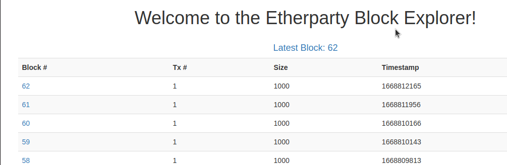

***Checkpoint – 1***: Now you have to make some transaction by sending ether from metamask to another account address that exists in ganache. After the transaction, refresh the  http://localhost:8000, and you should see some transaction details there. Also check the balance of the accounts of ganache. Show this to your teacher to tick-off Checkpoint-1.

# Section-2: Understanding files, truffle configuration and migration

Once this is done, we are ready to look at the smart contract development process using all these three technologies. 

1. First, open the terminal and create a directory called “**election**” and go to the directory:
```shell
mkdir election
cd election
```

2. Once you are inside the project, issue this command: 
```shell
truffle unbox pet-shop
``` 

3. Truffle comes with ready boxes that contain boilerplate (template) for various projects. Therefore, the above command should create a boilerplate application on the election folder.

4. Use command: ls and this should show some file list as below.

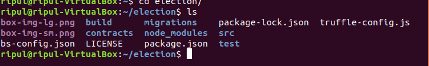

5. Next, we are explaining the contents of different files and directories in this boilerplate.

  i. **contracts directory**: This is where   all smart contacts live. There is already a Migration contract that handles the migrations of other smart contracts to  migrations to the blockchain

  ii. **migrations directory**: The JavaScript files in this directory are used to migrate the contract. Whenever we deploy smart contracts to the blockchain, we are updating the blockchain's state, and therefore need a migration.

  iii. **node_modules directory**: home of all of our Node dependencies.

  iv. **src directory**: client-side application html files and their corresponding JavaScript are stored here.

  v. **test directory**: test-cases for smart contracts are kept here.

  vi. **Truffle-config.js file**: This is the main configuration file for any Truffle project

6. Now, we will create our own contract skeleton first. But before that, **make sure to delete** all the sample contracts available inside the  “**contracts**” folder that came with the boilerplate code. Now, to create a skeleton contract. Issue this command: 
```shell
touch contracts/Election.sol
```

This will create a “**Election.sol**” file inside the contracts folder.

7. Copy the following solidity code of smart contract into Election.sol  file and save it. We already worked with solidity to create smart contract and this is just one of them.

```solidity
// SPDX-License-Identifier: GPL-3.0
pragma solidity >=0.7.0 <0.9.0;


contract Election {


   // state variable
   string public candidate;


   // Constructor
   constructor() {
       candidate = "Candidate 1";
   }
}
```

In this contract, we have created a contract called Election with a constructor that sets up the candidate variable with the string **“Candidate1”**. This constructor gets executed once the contract is initialised in the blockchain.

8. Now, **make sure to delete** any existing file inside the **migrations** folder and issue this command to create a deploy configuration file for migration below. You can choose the file name as you want but you need to make sure the naming format is 1_something.js, 2_some_name.js, 3_other_name etc. So we are naming it as "2_deploy_contracts.js".

```shell
touch migrations/2_deploy_contracts.js
```

9. Copy the following contents into the **2_deploy_contracts.js**  file of the migrations folder and save it.

```js
// requiring the contract
var Election = artifacts.require("./Election.sol");

// exporting as module 
 module.exports = function(deployer) {
  deployer.deploy(Election);
 };

```
Here, first, we require the contract called Election.sol that we've created, and assign it to a variable called "Election". Next, we add it to the manifest of deployed contracts to ensure that it gets deployed when we run the migrations.

10. Next, Open ***truffle-config.js*** file and change the port under ***development*** object to **8545**. If you notice the smart contract, we use **pragma solidity >=0.7.0 <0.9.0**; But, the default compiler version  of truffle is **v5.x.x** Therefore, we have to configure a suitable compiler version between **>=0.7.0 <0.9.0** to compile our contract. To do this copy the below configuration and paste it  after the object named **networks**. Make sure to put a comma at the end of **networks** object. After that,  save the config file. This will ensure that ganache will use compiler version 0.8.16 to compile our smart contract.

```js
// Configure your compilers
 compilers: {
   solc: {
     version: "0.8.16",    // Fetch exact version from solc-bin 
   }
 }

```

11. Now use this command to migrate the contract to the blockchain: 

```shell
truffle migrate
```
Explore the private blockchain visualizer to see this migration process and look at the deployed transactions. Also, look at Ganache to check the account balance. If successfully migrated, you should see a response like below:

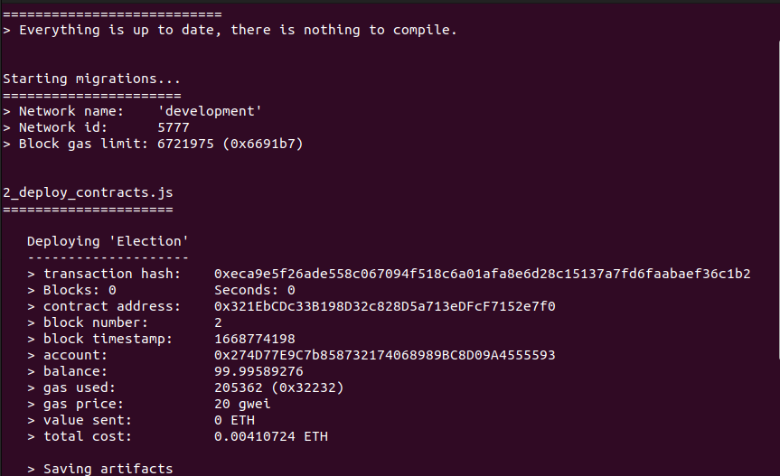

12. Check the account address in the image above. Truffle by default selects the first account listed on ganache for deployment of smart contracts. Therefore if you try to match the account address, you will find the account is the first account of ganache. The image below also shows  1 transaction( TX COUNT ) in the first account.

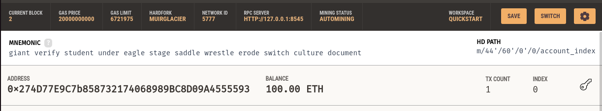

13. You can connect to the truffle console to interact with the smart-contract from terminal also with this command: 
```shell
truffle console
```

14. This will create a javascript console like the geth console that we used in our previous lab. In the truffle console, run this code: 

```shell
Election.deployed().then(function(instance) { app = instance }) 
```

In the console, you will see undefined, that is fine.

15. Then, in the console run this code: ```app.candidate()``` 

16. This should return **‘Candidate 1’** in the console which is retrieved through the smart-contract from the private blockchain of ganache. 

***Checkpoint – 2:*** Show this to your teacher to tick off Checkpoint - 2.

17. Finally write ```.exit``` to exit the truffle console(Notice: there is a dot). So in future, if you need to run your smart contract using ganache without any UI, this can be an option. However, this is not the only option as we already know one of the usecase of Remix IDE is to run contracts without our own UI. 

# Section-3: Contract testing
A test case is often useful to automatically test the functionalities of a smart-contract. In the next phase, we will develop a test case for some initial features of election  smart-contract. 

1. Open the ***Election.sol*** contract again within the **contracts** directory. Remove the previous code and paste the following code:

```solidity
// SPDX-License-Identifier: GPL-3.0
pragma solidity >=0.7.0 <0.9.0;


contract Election {
  // model a candidate
  struct Candidate {
    uint id;
    string name;
    uint voteCount;
  }
  // read/write candidates
  mapping( uint => Candidate ) public candidates;


  // store candidates count
  uint public candidatesCount;


  // Constructor
  constructor() {
    addCandidate( "Candidate 1" );
    addCandidate( "Candidate 2" );
  }

  // add candidate to participate the election
  function addCandidate( string memory _name ) private {
    candidatesCount++;
    candidates[ candidatesCount ] = Candidate( candidatesCount, _name, 0 );
  }
}

```

In this contract, we have created a new data type called **Candidate** using a struct which contains an integer id, string name and an integer voteCount for the particular candidate. There is a mapping which maps an id to its corresponding candidate. The **candidatesCount** variable stores the total number of candidates in the system. It also contains a function called ***addCandidate*** which adds a new candidate in the contract and updates corresponding variables.

2. Remember, whenever we modify smart contract we must deploy it again and since we have just modified the contract, we  need to migrate it again. Therefore, Use the following command to migrate this updated contract to the blockchain: 

```shell
truffle migrate --reset
```

3. Next, we will create a test case to test this contract. 

4. Issue the following command to create the test JavaScript file: 

```shell
touch test/election.js  
```

This will create a **election.js** file inside the **test** folder. This file basically contains our test cases.

5. Now, open the **election.js** file and paste the following contents:

```js
let Election = artifacts.require("./Election.sol");

 contract("Election", async function(accounts){
    console.log('Your Available Ganache Accounts: ' + accounts)
    
    it("initialize with two candidates", async function(){
        // fetching the deployed contract instance 
        const deployedContract = await Election.deployed()
        
        // calling the "candidatesCount()" function of the contract
        const numberOfCanddates = await deployedContract.candidatesCount()

        // checking if candidate count is 2. At the beginning the smart contract has two candidates
        assert.equal( numberOfCanddates, 2 )
   });

   it("it initialize the candidates with the correct values", async function(){
        // fetching the deployed contract instance 
        const deployedContract = await Election.deployed()

        // calling the public mapping data object "candidates" from smart contract | candidate 1 is being called
        const candidateOneAttribute = await deployedContract.candidates(1);

        // validating the initial value of candidate One.
        assert.equal( candidateOneAttribute[0], 1, "contains correct id" );
        assert.equal( candidateOneAttribute[1], "Candidate 1", "contains correct name" );
        assert.equal( candidateOneAttribute[2], 0, "contains correct votes count" );

        // calling the public mapping data object "candidates" from smart contract | candidate 2 is being called
        const candidateTwoAttribute = await deployedContract.candidates(2);
        
        // validating the initial value of candidate two.
        assert.equal( candidateTwoAttribute[0], 2, "contains correct id" );
        assert.equal( candidateTwoAttribute[1], "Candidate 2", "contains correct name" );
        assert.equal( candidateTwoAttribute[2], 0, "contains correct votes count" );
   });
});

```

Let me explain this code. First, we require the contract and assign it to a variable, like we did in the migration file. Next, we call the **contract** function, and write all our tests within the callback function. This callback function provides **accounts** variable that represents all the accounts on our blockchain, provided by Ganache. The first test checks that the contract was initialised with the correct number of candidates by checking the candidates count is equal to 2. The next test inspects the values of each candidate in the election, ensuring that each candidate has the correct id, name, and voteCount.


6. Issue the following command to run the test case: 

```shell
truffle test
```
7. If you observe the 2 passing logs like fig-5, then the test has been successful.


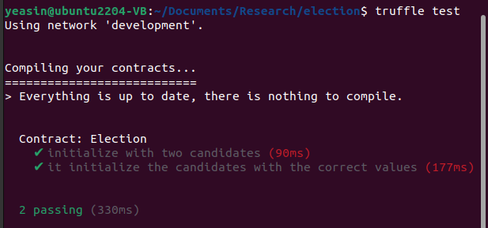


***Checkpoint – 3:*** If you are done till this part. Show this to your teacher.

# Section-4: Developing the DApp
In the next phase, we will start building a front-end for our application and then we will build the feature through which our DApp will maintain communication between blockchain and the frontend. You should follow this section steadily because even a simple unexpected comma can cause errors in this section.

1. First, open the **index.html** file under the src directory inside the election directory. Replace its contents with the following contents and save

```js
<!DOCTYPE html>
<html lang="en">
 <head>
   <meta charset="utf-8">
   <meta http-equiv="X-UA-Compatible" content="IE=edge">
   <meta name="viewport" content="width=device-width, initial-scale=1">
   <!-- The above 3 meta tags *must* come first in the head; any other head content must come *after* these tags -->
   <title>Pete's Pet Shop</title>


   <!-- Bootstrap -->
   <link href="css/bootstrap.min.css" rel="stylesheet">


   <!-- HTML5 shim and Respond.js for IE8 support of HTML5 elements and media queries -->
   <!-- WARNING: Respond.js doesn't work if you view the page via file:// -->
   <!--[if lt IE 9]>
     <script src="https://oss.maxcdn.com/html5shiv/3.7.3/html5shiv.min.js"></script>
     <script src="https://oss.maxcdn.com/respond/1.4.2/respond.min.js"></script>
   <![endif]-->
 </head>
 <body>
   <div class="container" style="width: 650px;">
     <div class="row">
         <div class="col-lg-12">
             <h1 class="text-center">Election Results</h1>
             <hr />
             <br />
             <div id="loader">
                 <p id="loader-msg" class="text-center">Loading...</p>
             </div>
             <div id="content" style="display: none;">
                 <table class="table">
                     <thead>
                         <tr>
                             <th scope="col">#</th>
                             <th scope="col">Name</th>
                             <th scope="col">Votes</th>
                         </tr>
                     </thead>
                     <tbody id="candidatesResults">
                       <tr><th>" + id + "</th><td>" + name + "</td><td>" + voteCount + "</td></tr>
                     </tbody>
                 </table>
                 <hr />
                 <p id="accountAddress" class="text-center">


                 </p>
             </div>
         </div>
    </div>
  </div>

  <!-- TODO_HTML-1: YOU WILL ADD A FUNCTION FOR CASTING VOTE BELOW THIS LINE -->

  <!-- TODO_HTML-1: YOU WILL ADD A FUNCTION FOR CASTING VOTE ABOVE THIS LINE -->

    <!-- jQuery (necessary for Bootstrap's JavaScript plugins) -->
    <script src="https://ajax.googleapis.com/ajax/libs/jquery/1.12.4/jquery.min.js"></script>
    <!-- Include all compiled plugins (below), or include individual files as needed -->
    <script src="js/bootstrap.min.js"></script>
    <script src="js/web3.min.js"></script>
    <script src="js/truffle-contract.js"></script>
    <script src="js/app.js"></script>
  </body>
</html>
```

2. Now open the **src/js/app.js** file. Replace its contents with the following contents:

```js
App = {
    // the vaiable below will store references of wallet, smart contract and your accounts
    webProvider: null,
    contracts: {},
    account: '0x0',
   
   
    initWeb:function() {
        // if an ethereum provider instance is already provided by metamask
        const provider = window.ethereum
        if( provider ){
          App.webProvider = provider;
        }
        else{
          $("#loader-msg").html('No metamask ethereum provider found')
    
          // specify default instance if no web3 instance provided
          App.webProvider = new Web3(new Web3.providers.HttpProvider('http://localhost:8545'));
        }
     
        return App.initContract();
    },
   
   
    initContract: function() {
        $.getJSON("Election.json", function( election ){
          // instantiate a new truffle contract from the artifict
          App.contracts.Election = TruffleContract( election );
     
          // connect provider to interact with contract
          App.contracts.Election.setProvider( App.webProvider );
    
          // TODO_JS-5:YOU WILL ADD listenForEvents() FUNCTION CALL DURING LAB SESSION BELOW"
          
          return App.render();
        })
    },
   
   // NOTE: render function starts below  
    render: async function(){
        // reference of html loading text
        const loader = $("#loader");
        // reference of all the html contents
        const content = $("#content");
     
        loader.show();
        content.hide();
       
        // open wallet and load account data
        if (window.ethereum) {
          try {
            // recommended approach to requesting user to connect mmetamask instead of directly getting the list of connected account
            const accounts = await window.ethereum.request({ method: 'eth_requestAccounts' });
            App.account = accounts;
            $("#accountAddress").html(`You have ${ App.account.length } account connected from metamask: ${ App.account } <br/> Current account in use: ${App.account[0]}`);
          } catch (error) {
            if (error.code === 4001) {
              // User rejected request
              console.warn('user rejected')
            }
            $("#accountAddress").html("Your Account: Not Connected");
            console.error(error);
          }
        }
   
        //load contract instance
        const contractInstance = await App.contracts.Election.deployed()
        // retrieving count of currentlt available candidate  
        const candidatesCount = await contractInstance.candidatesCount();

        
        const candidatesResults = $("#candidatesResults");
        candidatesResults.empty();

        const candidatesSelect = $("#candidatesSelect");
        candidatesSelect.empty();
   
   
        for (let i = 1; i <= candidatesCount; i++) {
            // calling the public mapping data object "candidates" from smart contract to retrieve voting candidates info
            const candidate = await contractInstance.candidates( i )
            const id = candidate[0];
            const name = candidate[1];
            const voteCount = candidate[2];
      
            // creating html template which will be added to frontend dynamically
            const candidateTemplate = "<tr><th>" + id + "</th><td>" + name + "</td><td>" + voteCount + "</td></tr>"
      
            // now adding the candidateTemplate html template dynamically into frontend
            candidatesResults.append( candidateTemplate );
      
            // TODO_JS-1: STUDENTS WILL ADD VOTING CANDIDATE SELECT OPTION DURING LAB SESSION BELOW

        }
      
        // TODO_JS-2: STUDENTS WILL ADD WHEATHER THE CURRENT METAMASK ACCOUNT WAS USED TO CAST VOTE BEFORE 
       
        loader.hide();
        content.show();
    },
    // NOTE: render FUNCTION ENDS ABOVE
    // TODO_JS-3: castVote WILL BE ADDED BELOW

    //TODO_JS-4: listenForEvents FUNCTION SOULD BE ADDED BELOW

   };
   
   
   $(function() {
    $(window).load(function() {
      App.initWeb();
    });
   });
   

```

3. Let's take note of a few things that this code does:
  i. **Set up web provider:** [web3.js](https://web3js.readthedocs.io/en/v1.8.1/) is a JavaScript library that allows our client-side application to talk to the blockchain. [Ethereum provider javascript API](https://eips.ethereum.org/EIPS/eip-1193) is another implementation for the similar purpose.  We configure the connection between client-side and  blockchain using the help  of these inside the "initWeb" function.

  ii. **Initialize contracts:** We fetch the deployed instance of the smart contract inside this function and assign some values that will allow us to interact with it.

  iii. ***Render function:*** The render function lays out all the content on the page with data from the smart contract. For now, we list the candidates we created inside the smart contract. We do this by looping through each candidate in the mapping, and rendering it to the table. We also fetch the current account that is connected to the blockchain inside this function and display it on the page.

4. Issue the following to deploy the contract: 
```shell
truffle migrate --reset
```

5. Start your development server using the following command: 

```shell
npm run dev 
```

6. It will create a web server at port 3000 and will automatically launch the service in the default browser.

7. Make sure metamask is there in your browser. Now, launch the service: **localhost:3000**. First your metamask will popup to establish a connection. if the connection is established you should see a green text mentioning “**connected**” or a Green Dot in the metamask like one of two images provided below: 

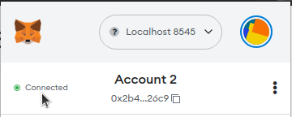


8. After that, you should see the following screenshot in your browser if you open the localhost:3000. It indicates your system is correctly deployed.

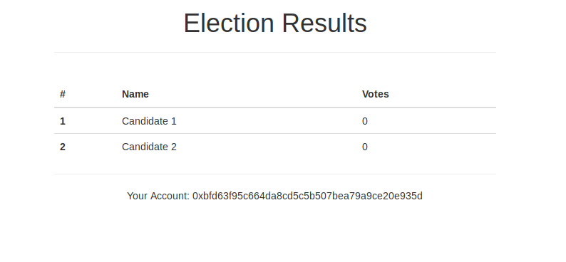

***Checkpoint – 4:*** If you are done till this part. Show this to your teacher. 

9. Now, we will complete our smart contract and the web app by adding voting functionalities. To do this, first we will complete our smart contract by adding the voting capability in our smart contract. Therefore, open the **Election.sol** contract inside contracts directory and replace it’s content with the content provided below. Once added, the final smart contract will look like this:

```solidity
// SPDX-License-Identifier: GPL-3.0
pragma solidity >=0.7.0 <0.9.0;


contract Election {


   // model a candidate
   struct Candidate {
       uint id;
       string name;
       uint voteCount;
   }
   // Store accounts that have voted
   mapping( address => bool ) public voters;


   // Read/write candidates
   mapping( uint => Candidate ) public candidates;

   // store candidates count
   uint public candidatesCount;

   // TODO_SC-1: YOU WILL ADD THE DECLARATION OF event votedEvent BELOW DURING THE LAB SESSION


   // Constructor
   constructor() {
       addCandidate( "Candidate 1" );
       addCandidate( "Candidate 2" );
   }


   // adding candidates
   function addCandidate( string memory _name ) private {
       candidatesCount++;
       candidates[ candidatesCount ] = Candidate( candidatesCount, _name, 0 );
   }


    // cast vote
    function vote( uint _candidateId ) public {
      // require that the current voter haven't voted before
      require( !voters[ msg.sender ]);


      // candidate should be valid
      require( _candidateId > 0 && _candidateId <= candidatesCount );


      // record voters vote
      voters[ msg.sender ] = true;


      // update candidates vote count
      candidates[ _candidateId ].voteCount++;

      // TODO_SC-2: YOU WILL ADD emit votedEvent BELOW DURING THE LAB SESSION
    }
}
```
Copy the whole of the content of the code and replace it into the **Election.sol** file and then save it. 

In this code, we have added a vote function. At first, the vote function checks if a particular voter has voted or not, using its address. If not, it executes the subsequent code. Next, it checks if the voted candidate is a valid candidate. If true, then the particular vote is recorded along with the address of the voter, so that the voter cannot vote again.

10. Since the smart contract has been updated we need to migrate it again using the command: 

```shell
truffle migrate --reset
```

11. Next, we update our **index.html** file to add the frontend options for voting capability. Open the index.html file in the ***election/src*** directory. Add the following lines of code before the script tag(There is a designated place(TODO_HTML-1) mentioned to paste the code) in the html file:

```html
<form onsubmit="App.castVote(); return false;" class="text-center">
  <div class="form-group">
    <label for="candidatesSelect">Select a candidate</label>
    <select class="'form-control" name="" id="candidatesSelect"></select>
  </div>
  <button type="submit">Vote</button>
  <hr />
</form>
```

Let's examine a few things about this form. At first, we create the form with an empty **select** element. We will populate the select options with the candidates provided by our smart contract in our **app.js** file. The **onSubmit** handler in the form will call the **castVote** function in our **app.js** file (added below).

12. Next, we update the app.js file in ***election/src/js*** directory. In step-11, we added the frontend code to select one candidate to vote. Now we will make that feature functional. To do this, copy the code below and paste it in the **TODO_JS-1**:

```js
//creating html template for voter candidate option which will be added to frontend dynamically
const candidateOption = "<option value=" + id +  ">" + name + "</option>"

// now the html candidateOption template is being dynamically added into the frontend dynamically
candidatesSelect.append( candidateOption )
```
In the code above, we are adding the candidate info such as **_id_** and **_name_** dynamically into the frontend(into the html) that we already fetched from smart contract.

13. Next, we will add the logic to check whether the currently connected and in used metamask account has already been used to cast vote or not. To add this logic paste the below code into the designated **TODO_JS-2** place inside the render function of app.js file.

```js
// checking if the currently metamask wallet account already voted | if already casted vote the account address will be returned 
const hasVoted = await contractInstance.voters(  App.account[0] )

// if already voted, voting form gets hidden
if(hasVoted){
  $( "form" ).hide()
}
```

14. When a user/voter clicks the vote button from frontend, we need to call a js function which will then call the smart contract and update the vote count of the selected voting candidate. To do this, paste the following code at the designated **TODO_JS-3** place available after the end of the render function. Make sure there is a a comma at the ending  bracke **}** of render function.

```js
  // Once the vote button from frontend is clicked, the function below will be called and update the smart contract 
  castVote: async function(){
    const contractInstance = await App.contracts.Election.deployed()
    
    // fetch the currently selected candidate value(This is the candidate id)
    const candidateId = $("#candidatesSelect").val();
    const result = await contractInstance.vote( candidateId, { from: App.account[0] } )

    alert("You have voted successfully")
  },
```

Now you are ready to use your application.

15. Now, if the terminal is running stop it by pressing **ctrl + c** and run it again.

```shell
npm run dev
```

Now open a browser with the Metamask installed and visit localhost:3000. and you should see a page like below:

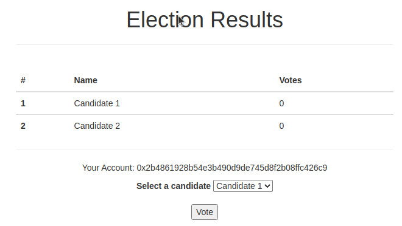


16. Explore the interface and cast your vote. Is there any wront ? Even though our DApp has complete functionalities, it lacks one feature. Once you cast vote, the updated vote count is not automatically shown in the browser. You need to reload the page. But can't we do it automatically ? Yes, there are two straightforward way. We can reload the page using only javascript. But how will javascript know that the smart contract has been updated and js can get the updated result now ? We can utilize **event** of solidity for such usecase. Therefore, we would like to address this shortcoming by leveraging the **event** functionality of Ethereum.

17. press **ctrl + c** to close the terminal where you entered **npm run dev**. Now, add the following line of code where the variables of the contract are declared( **TODO_SC-1** around line number: 25 ) in the Election.sol file:

```solidity
event votedEvent( uint indexed _candidateId );
```

16. Next, update the **vote** function in the smart contract by adding the following code at the end but inside of the **vote** function (**TODO_SC-2**): 

```solidity
// emit the event
emit votedEvent( _candidateId );
```


17. Next, we need to update our app.js file of ***election/src/js*** directory by adding the following function after the castVote function (**TODO_JS-4**). Don’t forget to add a **comma(,)** at the end of the **castVote** function if not available. The listenForEvents functions is invoked when an event is emitted from the contract calls. In this case when the "votedEvent" gets emitted from the contract.

```js
// voted event
listenForEvents: async function(){
  const contractInstance = await App.contracts.Election.deployed()

  contractInstance.votedEvent({}, {
    fromBlock: 0,
    toBlock: "latests"
  })
  .watch( function( err, event ){
    console.log("Triggered", event);

    // reload page
    App.render()
  })
}

```

18. However, javascript needs a listeners to catch the emitted event. Therefore, the line below inside the ***initContract*** function of ***app.js*** file (**at TODO_JS-5**) which initiates the listening activity when the web page loads.

```js
App.listenForEvents();
```


19. This is all that we need to add to run our dapp.

#

***Checkpoint – 5:*** Now you need to migrate the contract and you will see after casting vote, the table data for vote count automatically gets updated. Also you need to check the transaction details from the block visualizer we used earlier. Finally, show this to your teacher to tick-off the final checkpoint. 

