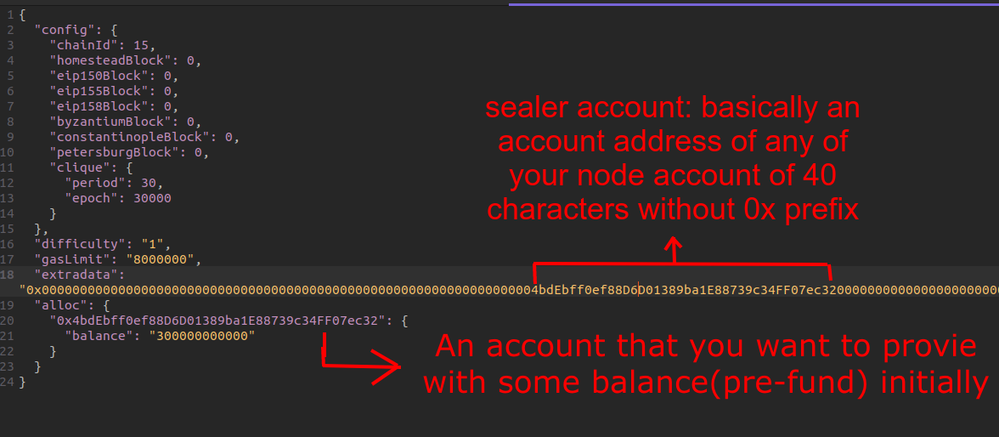
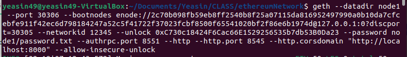
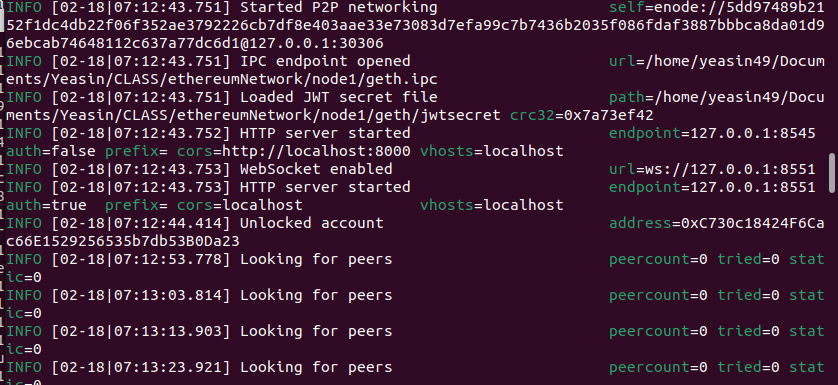

# Lab 4 : Ethereum Private Network and Smart Contract Interaction

## Objective: 
-   To create an ethereum private network and portray a scenario of how the network interacts in the real world. Students will also learn the basics of smart contract and how to deploy and communicate with it. 

## Submission: 
-   Checkpoints that need to be shown to the course teacher during the lab.

## Introduction:

In this lab, you will learn how to create and interact with an ethereum private network using Go Ethereum(geth) implementation. In addition, students will learn how to use Remix IDE for developing smart contracts. Finally they will learn how to interact with smart contracts from local test networks using geth javascript console.

Ethereum is an open source blockchain which facilitates the features of smart contracts. In the ethereum network hundreds of computers known as Ethereum Nodes get connected and create a peer to peer network that runs client software to store, validate and create blocks. Geth is one of these clients. To interact or to create such a network Go Ethereum(geth) implementation is widely popular. Go Ethereum also known as geth is the official go implementation of the ethereum protocol written in golang. Geth provides many client side tools for which it is thought as the standard for other ethereum nodes.

To develop, test and debug smart contracts using solidity language, Remix IDE is considered to be the best IDE among the blockchain developer community. It is considered as the industry standard  for its rich set of plugins, debug features having intuitive Graphical User Interface.

There are four tasks that you will need to complete in this lab. **_Complete all the tasks and show it to your teacher._**  At the end of this lab students should know - 
-   How to set up nodes for the private ethereum network
-   How to join network and interact
-   Basics of Remix IDE
-   Deploy and interact with smart contract in local ethereum private network

# Task-1: Development Environment Setup

In this lab, we will utilize the Ubuntu development environment. As it turns out, Ubuntu and Mac has rich support for Ethereum development tools. In recent times, these tools are also being made available for Windows. However, in this tutorial we will utilize Ubuntu. At first, you will setup your machine for the development.

## 1. Node Installation

To run the geth console, we need to install nodejs. You already know what nodejs is from your previous lab. Now, check if you already have nodejs and stable npm installed on your machine and using the following command:

```
npm version
```
If node is installed, its version number will be printed like v18.14.0. I am using version v18.14.0 and therefore the terminal showing it. Currently the LTS NodeJs version is v18.14.0. It is recommended to use any version that does not exceed the current LTS version of nodejs. Therefore if your nodejs and npm versions are stable you don’t need to install it again. Recommended node version <=  v18.14.0 and  npm version <= v9.3.1.

If you do not see the version number printer, you will need to install node. You can install node from any of the methods described below:

### Method-1: By using NVM
We recommend using NVM(Node Version Manager) through which we can install and use and manage any node version we want. This is a very useful tool for managing and working with different node versions we want. It helps to shift to any node version we want within minutes using just one command. To install node using nvm  use the following commands:

```
 sudo apt install curl
```
and 
```
curl https://raw.githubusercontent.com/creationix/nvm/master/install.sh | bash
```

The nvm installer script creates an environment entry to the login script of the current user. You can either log out and login again to load the environment or execute the below command to do the same.

```
source ~/.bashrc
```

Now, install any node version you want by following command: $  nvm install YourVersion
For Example: to install node v18.14.0 use command:

```
nvm install 18.14.0. 
```

Now, use command: 
```
nvm ls    
```
and you will see that some node versions are installed. Just select a recommended(v18.14.0) version from there by using commande:
```nvm use YOUR-DESIRED-VERSION``` 
for example:  ```nvm use v18.14.0```

Now, check node version by using command:  ```node -v```
You will see your selected version will appear in the terminal.

### Method-2: Direct Installation

To install node directly, use the following command:

```
sudo apt-get update
curl -fsSL https://deb.nodesource.com/setup_18.x | sudo -E bash - &&\
sudo apt-get install -y nodejs

```

Ensure that node has been properly installed by checking its version. Also, check if npm has
been installed as well using the following command: ``` npm version```

Thiscommand should show a version in the terminal.

## 2. Install Ethereum and Other Needed Tools

You can install ethereum and other necessary tools using the following commands: 

-       sudo apt-get install software-properties-common
-       sudo add-apt-repository -y ppa:ethereum/ethereum
-       sudo apt-get update
-       sudo apt-get install ethereum


Test your Ethereum installation with the following command:  ```geth version```
This should return versions details similar to the picture below: 


# Task-2: Ethereum Private Network Setup

In this section you will be setting up a simple private network of two ethereum nodes which will be running in your local mechine. For the rest of the sections , we will mention ethereum nodes as node. 

1. For this, create a folder called ethereumNetwork. Assume this is our root folder. Go to that folder and right click to open the terminal from there. Remember we will do all of our tasks inside this folder.

2. Now, create two directories for the two nodes by following command: 
```
mkdir node1 node2 
```
3. Now we will create a separate account for each of the nodes by following command:

For **Node1**:
```
geth --datadir node1 account new
```
This will ask for a password. After entering the password the following information is returned to the terminal.


Copy the public address of the key from the terminal and paste it in a place where you can find it later.

Now, for the account creation of **Node2** use the below command and enter a password similar to the account creation of node1. 
```
geth --datadir node2 account new
```
Again copy and paste the public address of the key in a place where you can find it later.


4. Now, we need to create a file in each node1 and node2 folder to save the password in those files. To interact with various accounts without saving the password in a file will require the accounts to be unlocked before every time we try to perform any transaction related task. In that case you can unlock the account using the command below:
```
personal.unlockAccount(“Your Account address”, “Your password”)
```
However, saving passwords will save time and also have some benefits in terms of security. Therefore, we will save passwords in a file in this lab. Now, create a file called password.txt in both node1 and node2 folder by following command: 
```
touch node1/password.txt node2/password.txt 
```
This will create a **password.txt** file in both the node1 and node2 folder.  Open the files, enter your password for node1 and node2 accounts in their own password.txt file and save it. 

5. Now, we need to create a genesis file. Genesis file contains the details of the genesis block, defining the initial state of your blockchain network configuration. This is stored in the very first block of blockchain. If you already have a genesis file, you can import that or you can create a new genesis file using “puppeth” which is an Ethereum Private Network Manager that comes with geth helper tools. When we run ‘puppeth’, it launches a CLI wizard. We can create a genesis block, that needs details mentioned below: 

-   Any random name of your network 
-   A conesus algorithm: Ethash(Proof-of-Work) and Clique(Proof-of-Authority).
-   Sealer Accounts: Can be mentioned more than one account as sealers.
-   Pre-fund Accounts:  Accounts that will be pre funded with ethers.
-   Network Id

Now run the command: 
```
puppeth
```
This will request us to enter a network name. You can enter any name you desire. However, for this lab purpose, we will name it **_ethblock_**. Therefore enter this name and After entering name, it will return the following response: 



Enter **2** for configuring new genesis. 

After Entering it a new request will come to choose a consensus algorithm. We will be using Proof-of-work, therefore enter **1** for using it. 


Next, you will see a request for entering account address for pre-funding. If you enter any account address here, it will provide that account with some ether at the very beginning. Though this is not mandatory but to understand clearly, copy the segment after 0x of the public address of your node1 account that you saved earlier in your convenient place and paste it to terminal using shortcut: ```ctrl + shift + v```


After entering, a new prompt will appear asking to precompile address for pre-funding 1 wei. Enter **yes** . Afterward, we need to enter our chain/network id. Importantly, we need to remember this id since ethereum nodes can connect in a network where they have similar network/chain id. For example, ethereum mainnet uses network id=1. Now for our lab purpose enter **12345** . Next, enter 2 for “Manage existing genesis” like below:


Finally, enter **2** for “Export genesis configuration” and just press enter again when it asks for the folder option to save the genesis file. This will create a genesis file in json format called ethblock.json as per our network name in the current working directory.  You should get a response like this: 


After getting this response, just press ```ctrl + d``` which will exit the “puppeth” CLI wizard.

Now if you check the ethereumNetwork folder, there will be a new file called **ethblock.json**. It basically contains information about the chain. Below is a reference to a sample genesis file.


6. Now, we can configure the both nodes so that they can join the same network using the ethblock.json file. To do it enter the command:

```
 geth init --datadir node1 ethblock.json
```

Repeat the command for node2 just replacing node1 to node2. This will write the genesis configuration in a folder named as “geth” for the private network in both the node1 and node2 folder.

7. Now we will create a dedicated “Bootnode”. One of the basic benefits of bootnode is that it helps peers to find each other's nodes in the same network. Bootnodes require a key and to generate a key enter the command mentioned below that will create a boot.key file in your ethereumNetwork folder. 
```
bootnode -genkey boot.key
```

8. Now, we will generate the bootnode. To generate a bootnode we must provide a key which we already have and also we need to assign it to a port as it continuously runs and helps ethereum nodes to find peers in the network. Now, enter the command below to generate a boot node:
```
bootnode -nodekey boot.key -addr :30305
```

Here, the port flag **-addr** can be arbitrary, however there are ports that are being used by others. For example ethereum mainnet uses port 30303. Therefore, we should avoid it. For our case we can use port 30305, 30306, 30307 etc. Now, if you have entered the command correctly you should see a log like below. There is a long string called enode. Copy the whole enode and save it in a place you can find later. We will see the use of this enode in the upcoming section. Therefore, If you see this, you have successfully initiated the bootnode in running state. Now leave this terminal window untouched and open a new terminal from the same working directory which is ethereumNetwork folder and do the rest of the task there.  


9. Finally, we can initiate our private ethereum nodes and connect them in the network. But for this, don’t close the terminal where bootnode is running. We should continue working in another terminal. Now to start our node1 we need to  enter  the following command  shown in the image below:



This command will run the node1 and connect it with the bootnode that we have 
created earlier. In the command --bootnodes  flag takes enode as parameter and the enode that we have provided here is the enode of the bootnode. Since our bootnode has occupied the port 30305,  we used --port 30306 here. We have used the network id flag --networkid 12345 here. If you can remember, “12345” is the same network id that we provided to the genesis file configuration when we had created it. Moreover, we see  --unlock  flag holding an address like this: ```0x2d8C4e6F29F5314AD0627AC7E63aa5FC710e4326 ```

If I Check the file where I have stored the public address of account of node1 and I will find this is the same address. You should use your public account address key here. Furthermore, the **--password** flag is pointing to a file which is in node1/password.txt. This is the file where we stored the password of the account of node1. In addition, for the flag **--http.corsdomain** we used “http://localhost:8000”, this is because we will visualize our blockchain transactions in that url in the upcoming section. After writing down the command, you should see logs similar to the picture attached below which 
refers that your node1 is now connected in the network:



10. Now keep this log running and leave the terminal untouched. Open a new terminal tab and enter the following command to connect the node2 with the bootnode so that it can join the network also. The command is shown below:


After connecting and joining the network leave this terminal window untouched so that node2 keeps running. If you notice the command for connecting the node2, you will see this command contains some new flags that were not available when we had connected the node1. Also some flags containing different values. Firstly, we used **--port 30307** since 30305 and 30306 are already occupied by bootnode and node1 respectively. Secondly, **--authrpc.port** is a new flag we used here because if we don’t explicitly use it, by default it will occupy 8551 port and for our case which is already occupied by node1 since we didn’t explicitly mention this flag for node1. Thirdly,  by default if we don’t explicitly  use the  **--http.port** flag, nodes occupy the default value which is 8545. So we used 8546 here. The rest are similar to node1. 

**_It should be remembered that if we want to connect a new node, these parameters must point to another port for that new node._**

Finally, you have successfully created a local ethereum private network with two nodes. However, this is still not a peer to peer network since node1 and node2 are running in the network but not connected to each other as peers. It is your task to connect two nodes as peers in the simplest way as the part of your homework which is provided at the end of this lab sheet.

## Task-3: Network Interaction
In this task, you will learn how to attach nodes with geth javascript console so that you can perform various actions inside the peer to peer network. Before going further, we must ensure our bootenode, node1 and node2 are running as we did in the previous section. Now  to move forward, first we will initiate the geth javascript console for node1 and node2.

1. Open a fresh new terminal tab or window and enter the command below to initiate the geth console for node1.
```
geth attach node1/geth.ipc
```
This will open a console for executing javascript code in our network. Open another 
terminal and enter the same command but instead of node1, do it for node2. If you do it 
correctly, you should see a console like below.


Notice there are some modules along with their version number mentioned in the 
console.  Among them admin:1.0, eth1.0, miner1.0, web3:1.0, personal:1.0 etc. are some important modules that you can use in this geth console. We will show you some transactions so that you can have a general idea how cryptocurrency exchanges work in real life using some of these modules.

2. We can check the list of our account addresses and balance using the functions below:   
```
 eth.accounts
 ```
 and

 ```
eth.getBalance(eth.accounts[ accountIndexNumber ])
 ```
Initially both of our nodes contain one account each. However we can create and use multiple accounts in a single ethereum node. If you check the balance of your node2 account, you will see the balance is zero. However, the account of node1 has some amount of balance. Now, try to remember, while creating the genesis configuration we added the account address of node1 for prefunding. This balance has generated from that prefunding genesis configuration.

3. Now go to the geth console of node1. and create a new account using the following function:
```
personal.newAccount(“enter your desired password”)
```
This will create a new account in the same node. Check accounts by entering:
```
eth.accounts
```
4. Check balance of the new account by entering:  
```
eth.getBalance(eth.accounts[1])
```
Currently the new account does not have any balance. So we will send some ether(wei) from our old account to the new account of node1. For this, call the following function: 
```
eth.sendTransaction({ from: eth.accounts[0], to: eth.accounts[1]: value: 5000 })
```
After entering the command, check the running network log of node1. You should see a submitted transaction request there like the picture below: 


Now copy the hash of the submitted request and check the balance of the new account. It is still zero. This is because our transaction request is now waiting to be mined by miners.

5. To visualize the process in real life we will use a block explorer. Copy the folder called “explorer” and paste the folder inside your ethereumNetwork folder. Now, go inside the explorer folder and open a new terminal window from there and write ```npm start```. This will start running a live block explorer of our network in http://localhost:8000. This is the reason we used this same url for **--http.corsdomain** flag while initializing the networks. Open the explorer from your browser from the mentioned url and initially you will see only one block there. This is the genesis block.

6. Now, from your geth console of node1, start mining using the command:
```
miner.start()
```

You should see some logs in the running network log terminal of node1 mentioning mining blocks like the pictures below. If you don’t see the logs, wait for a couple of minutes. Sometimes it takes time to start mining.


7. Now, if you check explorer, you will see, some new blocks are being created. Refresh the page and more blocks will appear there. Now from the same console where you started mining, enter: 
```
miner.stop()
```

This will stop the mining process of node1 and if you refresh the explorer page you will see no new blocks are being created. Check the explorer, there should be one block where Tx# column will have value 1. This means the block contains one transaction which is basically the transaction that we made to send ethers(wei) from one account to another. You should explore this explorer to understand transaction information. In real life, we can see this kind of information in explorers like https://etherscan.io . 


8. Now, again check the balance of the new account of node1 and you should see the value is 5000. Congratulations, you have just completed your first transaction. You can check the transaction details using command:  ```eth.getTransaction(“transaction-hash”)``` , here transaction-hash is the hash value that we copied from the submitted request. Now compare these details with the information you get from the explorer.

9. To practice in your leisure time, you can find all the available functions provided in geth console just by typing the module name in the geth console. For Example, type eth and press enter, you will see all the available functions of eth object. Similarly, check the functions of web3, personal, miner, admin etc.

## Task-4: Deploy and Interact with Smart Contract

Now, we are ready to look at the smart contract development process. We will look at the process in detailed fashion. But before that I would like you to go through the following steps in which you will code, deploy and interact with an Ethereum smart contract. While going through the steps, don’t worry, you can ask your instructor if any clarification is required.

1. The first step is to write a smart contract using Solidity. Solidity is a high-level programming language which is heavily used for writing smart-contracts for different blockchain  platforms. Similar to Java i t needs to be compiled using a compiler to create a byte code. To write and compile solidity, we will utilize Remix IDE which is a web-based solidity Editor and Compiler platform. It is located on: remix.ethereum.org. Go to the link and you will see a folder named contracts on the left side of the screen. Click the folder you will see some files with .sol extension. These are some demo smart contracts.  

2. Now, create a file called SimpleContract.sol in Redmix IDE and copy the following code and paste it there. Don’t get confused that I assigned a  sentence “Lab is almost done” in the userName variable. Those who are tired, this is just for fun and let you know that yes, the lab is almost done. :)

```solidity
// SPDX-License-Identifier: GPL-3.0
pragma solidity >=0.7.0 <0.9.0;


contract SimpleContract {


   string userName = "Lab is almost done" ;


   function setName(string memory name) public {
       userName = name;
   }


   function getName() public view returns (string memory){
       return userName;
   }
}
```

3. From the compiler section page of Remix, select the version 0.8.7 and then click Start compile. If the code is compiled successfully, you will see a green tick mark there. This program is very simple and similar to a Java program. A solidity program usually starts with the pragma keyword which defines the required compiler version. Different solidity compilers have different capabilities and different ways to express similar things. Therefore, it is important to set the correct compiler version. Then it defines the contract name, similar to the Java class. In this program we have just two methods and a public variable. The “setName” method with the supplied parameter is used to set the value of the “userName” variable. On the other hand,  the “getName” method is used to retrieve the current value of the “userName” variable. In particular, notice the way functions are defined in Solidity. The memory keyword specifies the data storage type. There are mainly two data storage types in Solidity: memory and storage. We will know about them later in our course. 

4. After successful compilation, click to the “Compilation Details” button, which will generate a pop-up window. In that window, you will find one option called “BYTECODE”. Open the option and scroll down until you find a key called “object” that is assigned to a large hex value. Copy the hex value.


5. Now, go to the geth console of node1 or node2. Let’s choose node1. Assign the copied hex code with a prefix 0x in a variable called contractHex. For example: ```contractHex= “0x60806040526040518060400160405…………```

6. In the pop-up window of “Compilation Details”, you will also find an option called ABI which contains some json data. copy the ABI from there. Now we need to format the value by removing extra spaces from the copied data  in order to use it. To do it, we can use the formatter https://codebeautify.org/remove-extra-spaces where we need to paste the ABI and remove the extra spaces. You can use any other json formatter if you want. Now copy the formatted value and assign it to a variable in geth console. For our lab, lets assign the value to a variable called “contractABI” like the image below: 


7. Now, create a contract interface by following line of code: 


8. Finally the contract can now be published in our local network. For this, write: 


In the above code, transaction fee will be deducted from eth.accounts[0] account.

9. Now, this will submit a transaction request to be mined. Now start the miner and when it is mined stop the miner. You will find the transaction in the explorer. To interact with the smart contract we must know the address of the smart contract where it is deployed. We can find the address of the deployed smart contract using the transaction hash. To do this, write: 


10. Now we can get the address of the deployed smart contract instance by following: 


11. To interact with the methods of smart contract we need to use we3. Therefore, we also need to create a reference of smart contract using web3 in the following way: 


12. Finally, using this reference we can call methods of our deployed smart contract by it’s address that we saved earlier in a variable ```deployedContractAddress```


Here we can see the initial value of our smart contract gets printed.

13. Now we also can set userName using the setName method by following: 


This will submit a transaction request to be mined. Therefore, if we call the “getName” now, we will not see the updated value. The value will not be updated until the transaction is mined.

14. Since blockchain is a peer-to -peer network, **any node or peer node** must start mining to add the transaction into the block. We start mining with the same node. However, we can use our node2 as a miner.  But to do this node1 and node2 must be connected in a peer-to-peer form. Currently both nodes are part of the network but they aren't peers of each other. So this will be your task to create a peer to peer network as homework mentioned at the end of this lab sheet. Don’t worry, you will get a hint. Now for this lab, we will again start mining using node1’s geth console. When the transaction is mined we again can call the getName method and can see the updated data is showing like below: 


Congratulations, you have successfully completed interaction with the smart contract that concludes our today’s lab.

## Homework

You should complete the following task sequentially. [ Note: task- a, b, c, d should be completed sequentially ]

1. You have to develop an ethereum private network of three ethereum nodes that are connected in the network using a bootnode. You have to take screenshots of running bootnode, node1, node2, and node3 and the connected geth console. [ Hint: Simply following till a specific part of Taks - 3 of the lab sheet should be good enough ]

2. Connect node1, node2 and node3 in a peer-to-peer form. You have to take screenshots of the enode of node1, node2 and node3. In addition, you have to show peers list from one of any node and the balance of the account of node3 [ Hint: study the “admin” method of geth console. ]

3. Send some ether from an account of node1 to an account of node2 while the miner should be the node3. Show the transaction information from the block explorer. [ Hint: You can directly use the account address of node2. ]

4. Modify the smart contract so that you can send an integer( Range: 0 - 10  ) value in a function parameter which will be added with your student ID. Also create a method through which you can get the added value. You have to interact with the smart contract from the geth console. Take the screenshot of the function calls and their response and also take a screenshot of the smart contract.

In addition with the screenshot you have to send all of the files of above tasks in a zip format.
